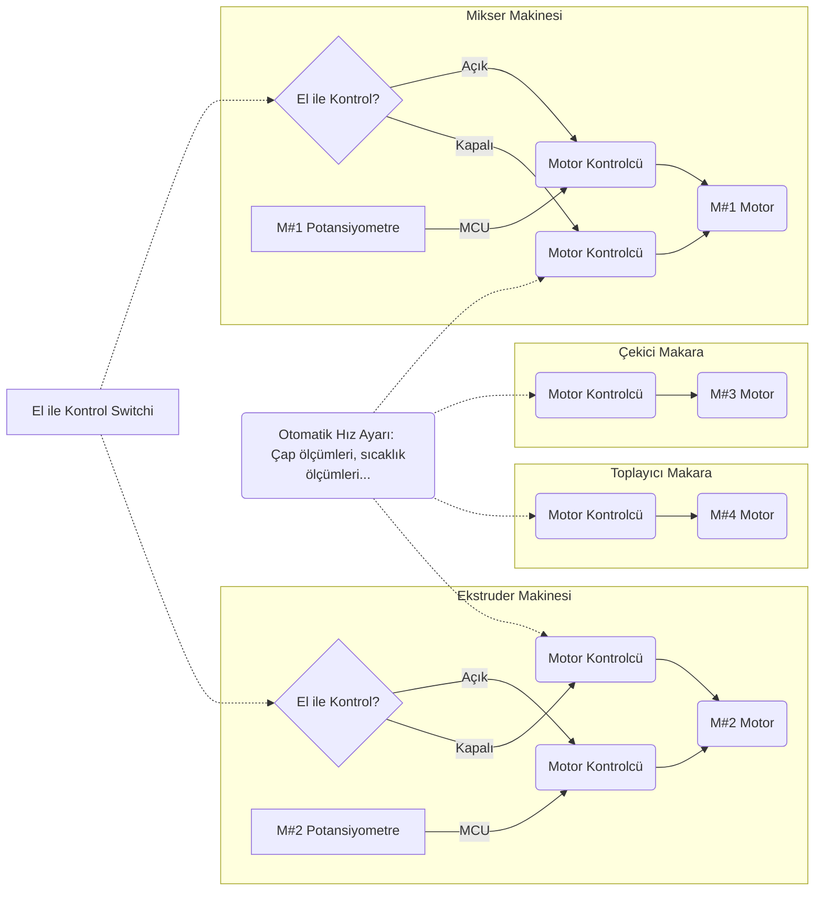

# TE Filament Üretimi Elektronik Kontrol Ünitesi

Bu projenin elektronik yapısının direk tasarımından önce girişlerimizi ve çıkışlarımızı kararlaştırmalıyız. Bu giriş/çıkışları kararlaştırıp tasarım aşamasında ek bir giriş/çıkış eklememek kontrol için işimizi kolaylaştıracaktır. Bu metin boyunca kullanacağım

1. *M#1*: Mikser makinesi,
2. *M#2*: Ekstruder makinesi,
3. *Ö#1*: Birinci çap ölçer sistemini,
4. *M#3*: Çekici makara makinesini,
5. *Ö#2*: İkinci çap ölçer sistemini,
6. *M#4*: Toplayıcı makara makinesini

anahtar kelimelerin anlamları bu liste aracılığı ile hatırlanabilir.

### Girişler

* M#1 için motor hızı ayarlama adına kullanılacak potansiyometre
* (Eğer istenirse) M#1'den M#2'ye karışımın aktarılması için kullanılacak sistemin girişleri (örneğin bir boru içinde hava üfleme aracılığı ile gönderilecekse, hava pompasının basınç ayarını vereceğimiz potansiyometre)
* M#2 için hız kontrolü ve sıcaklık kontrolü için potansiyometre veya butonlar
* M#2 üstündeki kelepçe ısıtıcıların sıcaklıkları (ısıtıcının üstünde yerleşik bir sıcaklık sensörü yoksa termokupl kullanımı gerekli)
* Ö#1'den alınacak çap (cihaza göre derinlik) bilgisi
* Ö#2'den alınacak çap (cihaza göre derinlik) bilgisi
* LCD ekranı kontrol edebilmek için üç tane buton (sağ, sol ve tıkla) (Eğer istenirse potansiyometre kullanılmadan bu tuşlarla ayar yapılabilir.)
* Acil durumu butonu
* El ile kontrol switchi

### Çıkışlar

* M#1 için motor hızı ve dönüş yönü
* (Eğer istenirse) M#1'den M#2'ye karışımın aktarılması için kullanılacak sistemin çıkışları (örneğin bir boru içinde hava üfleme aracılığı ile gönderilecekse, hava pompasının basınç ayarı)
* M#2 için itkiyi oluşturan motorun hızı
* M#2 için kelepçe ısıtıcıların sıcaklık ayarları
* M#3 için motor hızı (Bu hız M#2'nin belirlenmiş hızına ve çap ölçümlerine göre otomatik ayarlanacak.)
* M#4 için motor hızı (Bu hız M#2'nin belirlenmiş hızına ve çap ölçümlerine göre otomatik ayarlanacak. )
* Tüm bu hız, sıcaklık bilgilerinin kontrol edilebileceği bir LCD ekran

## İlişki Diyagramı

